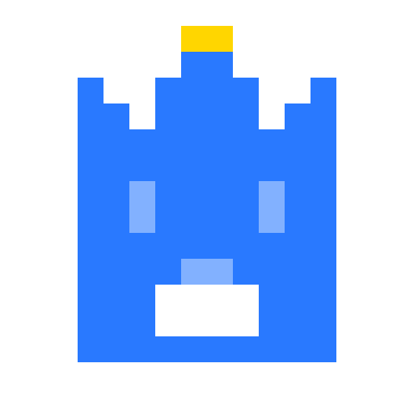
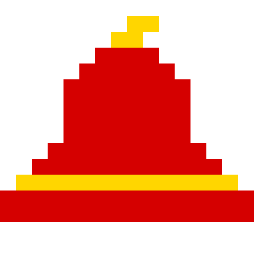
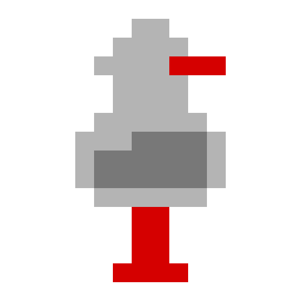
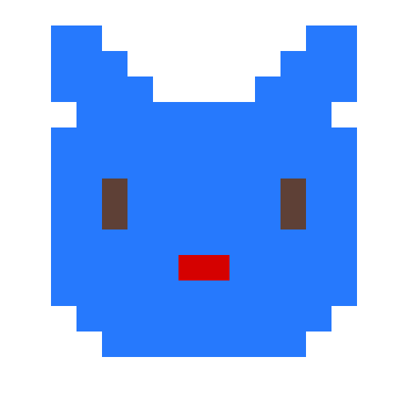
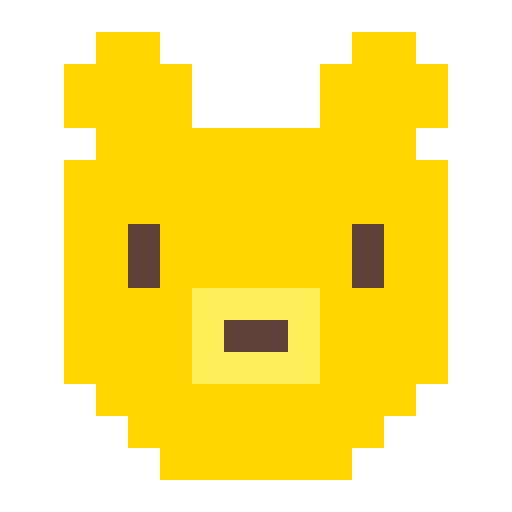

# yoto

Generate 16x16 pixel art icons for Yoto MYO cards using AI.

## Quick start

```sh
nono run --profile nono-profile.json -- claude --dangerously-skip-permissions -p "create a yoto pixel art icon for a playlist called Lullabies"
```

## Gallery

&nbsp;&nbsp;&nbsp;&nbsp;&nbsp;&nbsp;&nbsp;&nbsp;
